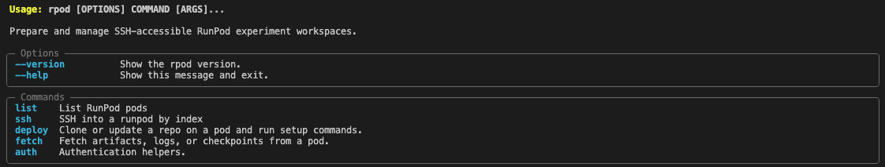

# rpod-cli

`rpod` simplifies RunPod experiment setup by automating repo deployment and environment setup on RunPod pods.



The published package name is `rpod-cli`; the installed shell command is
`rpod`.

Status: early alpha.

## Install

Install directly from GitHub:

```bash
pip install git+https://github.com/gradnorm/rpod-cli.git
```

Or clone the repo and install locally:

```bash
git clone https://github.com/gradnorm/rpod-cli.git
cd rpod-cli
pip install .
```

For development:

```bash
pip install -e ".[dev]"
```

After install, the CLI command is available as:

```bash
rpod --help
```

## Get Started

To get started, set your RunPod API key.

```bash
export RUNPOD_API_KEY="..."
```

## List RunPod pods:

```bash
rpod list
```

Example output:

```text
                                        RunPod Pods
┏━━━━━━━┳━━━━━━━━━━━━━━━━┳━━━━━━━━━━━━━━━━┳━━━━━━━━━┳━━━━━━┳━━━━━━━━━━━━━━━━━━━━━━┓
┃ Index ┃ Name           ┃ ID             ┃ Status  ┃ GPUs ┃ SSH                  ┃
┡━━━━━━━╇━━━━━━━━━━━━━━━━╇━━━━━━━━━━━━━━━━╇━━━━━━━━━╇━━━━━━╇━━━━━━━━━━━━━━━━━━━━━━┩
│ 1     │ ************** │ ************** │ RUNNING │ 1    │ ***.***.***.***:**** │
└───────┴────────────────┴────────────────┴─────────┴──────┴──────────────────────┘
```

Commands such as `rpod ssh`, `rpod deploy`, and `rpod fetch` use the index
displayed in `rpod list` to select the target pod.

## List GPU types:

```bash
rpod gpu list
```

Use the GPU index from `rpod gpu list` when creating a pod.

## Create a pod:

```bash
rpod create \
  --gpu-index 1 \
  --name train-test \
  --image runpod/pytorch:2.4.0-py3.11-cuda12.4.1-devel-ubuntu22.04 \
  --disk 50 \
  --volume 50 \
  --ports "22/tcp" \
  --cloud SECURE
```

You can also select a GPU by ID:

```bash
rpod create \
  --gpu "NVIDIA GeForce RTX 4090" \
  --name train-test \
  --image runpod/pytorch:2.4.0-py3.11-cuda12.4.1-devel-ubuntu22.04
```

## Deploy a repo and run setup:

```bash
rpod deploy \
  --index 1 \
  --repo git@github.com:your-org/your-repo.git \
  --ssh-key ~/.ssh/runpod_ed25519 \
  --github-deploy-key ~/.ssh/github_deploy_key \
  --checkout main \
  --install-uv \
  --uv-sync
```

`--ssh-key` is the key used to connect from your machine to the pod.
`--github-deploy-key` is copied to the pod so the pod can clone a private
GitHub repo.

Deploy does the following:

- resolves `--index` using the RunPod API
- connects to the pod over SSH
- optionally copies the GitHub deploy key to the pod
- configures SSH on the pod to use that key for `github.com`
- clones the repo if missing, or fetches and pulls if it already exists
- checks out the requested branch, tag, or commit
- optionally installs `uv`
- optionally runs `uv sync`

For public repos, omit `--github-deploy-key`.

## SSH into a pod:

```bash
rpod ssh --index 1 --ssh-key ~/.ssh/runpod_ed25519
```

## Stop or terminate a pod:

Stop releases the GPU while keeping the pod volume data:

```bash
rpod stop --index 1
```

Terminate deletes the pod. Export or fetch anything important first:

```bash
rpod terminate --index 1
```

Both commands ask for confirmation before running.

## Fetch artifacts:

```bash
rpod fetch \
  --index 1 \
  --remote-path /workspace/your-repo/sim_out \
  --local-path ./downloads/sim_out \
  --ssh-key ~/.ssh/runpod_ed25519
```

Fetch and archive a directory as `.tar.gz`:

```bash
rpod fetch \
  --index 1 \
  --remote-path /workspace/your-repo/sim_out \
  --archive \
  --ssh-key ~/.ssh/runpod_ed25519
```
